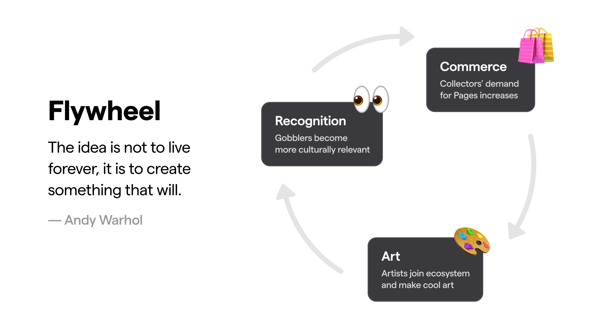

# Gobbler Prophouse DAO

We’re building a Gobbler Prophouse DAO. It’s a place where Art Gobbler holders can group together and allocate those produced GOO to fund those most innovative ideas. 

## Intruduction 
Besides 1/1 art, we believe Art Gobblers can create a bunch of innovative NFT projects based on the Flywheel, including 10k PFP, membership NFTs, and even Gaming NFT projects. 



Obviously, a large NFT project requires more resources than a stand-alone art project. It needs more pages, more supporters, and even more funding. And for those Art gobblers NFT holders, they are actively looking for some interesting projects to collect and support. Prophouse can gather those NFT holders to help those ambitious NFT project founders create a large NFT project in the Art Gobbler ecosystem.

## How it Works
1. NFT project founders can propose their ideas and look for funding on Prophouse. Those founders need to write down the specific project content, fund amount, and return for the DAO, just like Nouns prophouse.
2. Art Gobblers NFT holders can participate in Prophouse DAO. All the produced GOO will be locked in the treasury to support those good NFT projects.
3. Every week, DAO members can vote and choose the best proposals to support in Prophouse DAO. The GOO tokens will be allocated to the chosen project. The chosen project can use them to create pages and even trade it into ETH to start the project.
4. DAO members can also make proposals to group together to create the legendary gobbler.
5. After the project is finished, the corresponding return will be returned to Prophouse DAO. For example, the funded project may give the DAO 10% revenue of their created NFTs.

## Get Started
```
forge build
forge test
```

Special thanks to the [Art Gobblers](https://github.com/artgobblers/art-gobblers) project for the amazing ecosystem and foundation, and [nounsDAO](https://github.com/nounsDAO/nouns-monorepo) for the idea inspirations. 